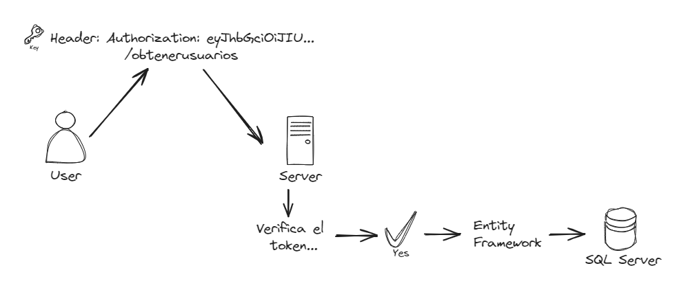

# Starter Backend .NET con Login JWT

Backend hecho con C# .NET 8.0 con autenticación JWT y Entity Framework Core. 

La idea es simplificar el proceso de realizar el backend de las futuras aplicaciones que se haga en Grupo Limpiolux. 

## Concepto de JWT 

JSON Web TOKEN (JWT) es una forma segura de transmitir información entre dos partes. En este caso, el cliente y el servidor. 

El cliente envía un token al servidor, el servidor verifica que el token sea válido y si lo es, le permite al cliente acceder a los recursos que necesita.

.e. El cliente se loguea, el servidor le devuelve un token, el cliente envía el token en cada request, el servidor verifica que el token sea válido y si lo es, le devuelve la información que necesita.



## Desarrollo local

### Entity Framework

- Asegurarse de tener instalador .NET 8.0.

- Secesita tener instalado Entity Framework de manera Local. Esto se hace con el siguiente comando:

```bash	
dotnet tool install --global dotnet-ef
```

- Para crear la primera migración se deben de asegurar que en el archivo `appsettings` este bien configurado el DefaultConnection con los datos del servidor y usuario, despues se debe correr el siguiente comando:

```bash
dotnet ef migrations add first-migration
```

- Para aplicar la migración y crear las tablas en el SQL Server se debe correr el siguiente comando:

```bash
dotnet ef database update first-migration
```

### Iniciar el servidor

Finalmente solo dan a Ctrl + F5 en el Visual Studio y el servidor se iniciará en el puerto 5139.
